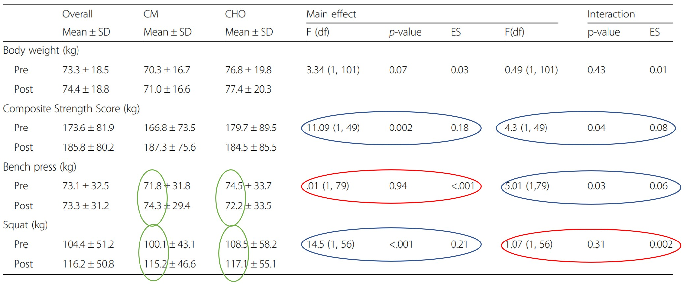

\captionsetup[figure]{name=Abbildung}
\captionsetup[table]{name=Tabelle}

```{r setup, include=FALSE}
knitr::opts_chunk$set(echo = TRUE)
knitr::opts_chunk$set(warning = F)
knitr::opts_chunk$set(message  = F)
knitr::opts_chunk$set(fig.align = "center")
```


# Zweck der Übung

Diese Aufgabe hat zum Zweck einen Artikel etwas genauer unter die Lupe zu nehmen und auf Stimmigkeit zu überprüfen. Dazu wird zuerst die zugrundeliegende Studie analysiert, um Rückschlüsse auf die Aussagen des Artikel zu ziehen.

## Schokoladenmilch gegen normale Sportgetränke {#article}

Andy Chesire beschreibt in einem Artikel vom 22. August 2017 die Resultate einer Studie von der Universität Texas at Austin über den Unterschied von "post-training" eingenommener Schokoladenmilch (CM = Kohlenhydrate + Proteine) und normalen Sportgetränken (CHO = nur Kohlenhydrate).

Herr Chesire erklärt: 

Die Athleten, die Schokoladenmilch tranken, drückten im Durchschnitt **3,5%** mehr als vorher auf der Hantelbank, während die Sportler, die das kommerzielle Sportgetränk tranken, ihre Kraft beim Bankdrücken um etwa **3,2%** verringerten. Das ist ein Nettounterschied von **6,7%** für diejenigen, die Schokoladenmilch im Vergleich zu einem kommerziellen Sportgetränk tranken.

Beide Gruppen zeigten eine Verbesserung bei Kniebeugen, aber die Schokoladenmilch-Trinker zeigten mehr, sie hoben **15%** mehr Gewicht als vorher - während die Trinker von kommerziellen Sportgetränken nur **8%** mehr hoben. Das ist fast **doppelt** so viel Kraftzuwachs wie bei der Einnahme von Sportgetränken.$\ _{1}$

Weiter beschreibt Herr Chesire, dass der Unterschied von *normalen Sportgetränken* darin besteht, dass dem Sportgetränk das Protein fehle, wobei Milch zwei Arten von hochwertigem Protein enthält, Kasein und Molkeprotein. Weiter wird beschrieben, dass Milch pro Unze (28.35g) jeweils ein Gramm Protein enthält, welches in Kombination mit den Kohlenhydraten aus der Schokomilch ein ideales Verhältnis zur Muskelregeneration enthält.$\ _{2}$

Hinzufügend wird gesagt, dass Schokomilch ein kostengünstiges Getränk  zur Rehydration ist, zum Auffüllen der glykämischen Speicher dient und den Muskelaufbau unterstützt. Weitere Studien könnten herausfinden, wie andere Faktoren die Ergebnisse beeinflusst haben - Aspekte wie die Technik oder die Lebensmittel, die die Sportler zu Hause essen. Die Studie unterstützt jedoch Schokoladenmilch als Regenerationsergänzung für Jugendliche, die an intensivem Training teilnehmen.$\ _{2}$

Desweiteren ist die Studie verlinkt.


$\ _{1}$ *Original aus dem Englischen ins Deutsche übersetzt [@article]*
$\ _{2}$ *Sinngemäss aus dem Englischen ins Deutsche übersetzt [@article]*

\newpage


# Informationen zur Studie und dem Artikel

Die Studie [@study] wurde von der University of Texas at Austin USA durchgeführt, wurde finanziert von Dairy Max, einem Verband von Milchprodukte-Vertretern und erschien im Journal of the International Society of Sports Nutrition. Der Artikel [@article] ist auf der Website von Dairy Max erschienen und wurde von Andy Chesire, welcher ebenfalls an der Studie beteiligt war, verfasst.

## Beschreibung der Studie

Ziel der Studie war es, den Effekt zu untersuchen, ob die Einnahme von Schokoladenmilch im Gegensatz zur Einnahme eines herkömmlichen Sportgetränkes, für die Erholungsphase von heranwachsenden Athleten einen Unterschied macht. 103 heranwachsende Athleten (Frauen und Männer) wurden während eines 7-wöchigen Sommer Trainingprogrammes entweder CM (Schokoladenmilch) oder CHO (Kohlenhydrate) direkt nach dem Training verabreicht. In der ersten Woche, sowie in der letzten Woche wurden Kraft und Ausdauertests durchgeführt. Wobei 5 Wochen lang jeweils 4 Tage pro Woche trainiert wurde. Die Trainingseinheiten bestanden aus jeweils 1 Stunde Kraft und 1 Stunde Ausdauertraining pro Trainingstag, wobei direkt nach der letzten Trainingseinheit das Getränk verabreicht wurde.


## Grundgesamtheit

Die Studie möchte einen Effekt der Einnahme von Schokoladenmilch als Erholungsgetränk nach einem Training untersuchen, da diese ohne weitere Verarbeitung einnehmbar ist, weit verbreitet und überall erhältlich ist. Die Studie referenziert auf andere Studien, in welchen ein positiver Effekt von protein- und kohlenhydrathaltigen Nahrungsergänzungsmittel an Erwachsenen festgestellt werden konnte. Hier möchte man nun den Effekt an jugendlichen High School Sportler in den USA analysieren, da diese mit einer Anzahl von [@survey] 7'963'535 (Saison 2016-2017) eine grosse Zielgruppe repräsentieren und in bisherigen Studien ausser Acht gelassen wurden.


## Auswahlrahmen

Der Auswahlrahmen soll die Grundgesamtheit möglichst gut repräsentieren. In dieser Studie wurden Teilnehmer eines Sommer-Traininglagers einer grossen westlichen High School ausgewählt. Es stellt sich die Frage, ob rein nur die Testteilnehmer einer Schule repräsentativ für sämtliche High School Sportler der USA sein sollen und somit der Auswahlrahmen die Grundgesamtheit adäquat repräsentiert. Auf diese Frage werden in der Studie keine klaren Antworten geliefert.

In der Studie wird der Einsatz von Schokoladenmilch für die Erholungsphase getestet; ist nun der Anteil an Personen, die eine Unverträglichkeit gegen Laktose haben, sehr hoch könnte es sein, dass man allenfalls auf andere Ergebnisse kommen würde.

\newpage

## Stichprobe

Die Studie beschreibt, dass die Teilnehmenden zufällig in die 2 Kategorien CM und CHO eingeteilt wurden. Eine genaue Auflistung der gekreuzten Variablen ([Gruppierungen](#stichprobendesign)) zu den beiden Testkategorien wird in der Studie nicht aufgezeigt, jedoch beschreiben die Herausgeber der Studie, dass keine statistische Unterschiede in den Gruppierungen festzustellen wären.

Die Teilnehmer der Studie mussten folgende Eigenschaften erfüllen:

* müssen Englisch sprechen
* sollen per Textnachricht erreichbar sein (Besitz eines Handys)
* keine Verletzungen aufweisen
* keine mentale oder physische Beeinträchtigungen
* keine Allergien (auf Stoffe, welche die verabreichten Getränke beinhalten) oder Laktoseintoleranz

Gemäss [@lactose] sind ca. 30% der erwachsenen Leute in den USA laktoseintolerant. Bei gewissen Bevölkerungsgruppen liegt die Laktoseintoleranz sogar weit höher, zum Beispiel Personen, mit asiatischen Wurzeln mit bis zu 90%. Diese Zahlen wurden zwar für erwachsene Menschen erhoben, jedoch schliessen sie eine nicht unerheblichen Teil, der Grundgesamheit aus. Somit könnte das Ausschliessen von Menschen mit einer Laktose-Unverträglichkeit eine Verzerrung auf die Grundgesamtheit aufweisen.

Womöglich hätte die Einnahme von Schokoladenmilch bei einer laktoseintoleranten Person zu einem negativen Effekt auf das physische Training geführt und somit auch die Hypothese selber. Natürlich ist klar, dass eine laktoseintolerante Person nicht freiwillig Schokoladenmilch zu sich nehmen würde. Die Grundgesamtheit sollte somit sämtliche jugendliche High School Sportler enthalten, die nicht laktoseintolerant sind. Oder einfach ausgedrückt, die Grundgesamtheit beinhaltet nur jugendliche High School Sportler, welche die obigen Eigenschaften erfüllen.


### Anzahl und fehlende Werte

Es haben 131 Teilnehmer des Trainingslagers an der Studie teilgenommen, davon haben 103 die Studie beendet.
Die 28 fehlenden Werte (Nonresponses) werden nicht weiter diskutiert und es ist somit nicht klar, warum diese aus der Studie herausfallen, oder wann und warum der Versuch abgebrochen wurde. Man erhält auch keine Information darüber, wieviele Nonresponses aus welcher Gruppe stammen.

Falls die fehlenden Werte *Missing completely at random* (MCAR) sind, würde diese wohl kaum einen grossen Einfluss auf die Resultate haben, bis auf die grössere Ungenauigkeit durch die kleinere Stichprobe. Eine weitere Überlegung wäre der Einfluss einer geschickten Imputation der 28 fehlenden Werte. Man könnte schauen, welchen Beitrag diese zur Auswertung der Resultate beitragen könnten. Desweiteren könnten die fehlenden Werte die Resultate extrem verzerren, wie ein später folgendes [Gedankenexperiment](#missing) aufzeigt.

## Stichprobendesign {#stichprobendesign}
Die Teilnehmer wurden bereits von den Trainern des Trainingslagers in 3 Gruppen aufgeteilt. Die erste Gruppe enthält nur weibliche Teilnehmer im Alter zwischen 13-17 Jahren. Die zweite Gruppe enthält männliche Teilnehmer im Alter zwischen 13-15 Jahren und die dritte Gruppe enthält männliche Teilnehmer zwischen 15-17 Jahren.

In der Studie wird nicht erwähnt, ob die Stichprobe aus der gesamten Anzahl an Teilnehmenden gezogen wurde, oder ob auf eine bestimmte stratifizierte Art aus den von den Trainern vorselektierten Gruppen gezogen wurde (also ob beispielsweise gleichmässig gezogen wurde oder je nach relativen Häufigkeiten in den Gruppen).

Desweiteren werden laut der Studie keine Unterschiede in den drei Gruppen bezüglich Alter, Rasse und Ethnie festgestellt. Dies wird mit jeweils mit einem einzigen signifikanten p-Wert aus einem t-Test festgehalten. Es ist nicht klar wie dieser Wert ermittelt wurde, da ein t-Test immer zwischen  zwei Gruppen  stattfindet. Man müsste  hier 3 Tests zwischen den Gruppen durchführen oder ein anderes Testverfahren wählen zb. ANOVA.

\newpage

### Designgewichte

In der Abbildung \ref{fig:subjects} sind Metadaten der Teilnehmenden der Studie aufgelistet. Auffallend ist, dass hier scheinbar nicht sorgfältig gearbeitet wurde. Die Teilsummen der einzelnen Unterkategorien führen nicht zu den von der Studie gegebenen Werte. Es sollte eine Stichprobe von 103 Teilnehmenden sein. Die Summe der Teilnehmer in der roten Box ergibt 98. Summiert man die einzelnen Gruppen zusammen erhält man 102 Teilnehmer. Offensichtlich wurden hier Fehler gemacht. Vermutlich handelt es sich um fehlende Werte, die wiederum nicht adäquat behandelt wurden, beziehungsweise nicht imputiert wurden.

&nbsp;

```{r subjects, out.width='100%', fig.cap="Auflistung der Studienteilnehmer.", echo=FALSE,fig.align="center"}
knitr::include_graphics("subjects.jpg")
```
&nbsp;

Für die Repräsentativität der Schüler wollten wir diese mit der Diversitätsverteilung des offiziellen Statistik-Amtes der USA vergleichen. Leider fanden wir nur Daten über die Diversitätsverteilung über alle High School Schüler und nicht nur über High School Athleten [@race]. Daraus lässt sich nicht unbedingt schliessen, dass dies auch auf die Verteilung der US-Highschoolsportler zutrifft, aber es lässt doch Zweifel offen, ob die Verteilungen übereinstimmen. 

Für Rasse und Ethnie gibt es scheinbar verschiedene Definitionen und Auslegungen. Beim offiziellen Amt wurde Hispanic in eine eigene Gruppe aufgeteilt, während in der Auflistung der Studie Hispanic eine Unterkategorie der Rassen ist und seperat aufgeführt wurde. Recherchen ergaben, dass die Ethnie Hispanic aus jeder Rasse entstammen kann, also eine Teilmenge der Population sind [@race]. Für eine qualitative Vergleichbarkeit von Studie und Statistik haben wir nach gutem Gewissen die Daten anteilsmässig angepasst (auch bei extrem einseitiger Anpassung wäre die Studienverteilung weit von derjenigen des offiziellen Amtes abgewichen).

\newpage

In Abbildung \ref{fig:dk} sind die beiden Diversitätverteilungen visualisiert. Der Anteil der weissen Schüler über die gesamten USA ist viel höher als die der Stichprobe der Studie (ganz rechts). Mit schwarzen Schülern ist es gleich umgekehrt, der Anteil in der Studie ist um einiges grösser, als aus der Statistik.

Auch der Anteil an weiblichen Athletinnen mit 30 zu 73 männlichen Athleten ist fragwürdig. Falls die Stichprobe die Grundgesamheit nicht repräsentiert, müssten die Designgewichte angepasst werden, jedoch wird in der Studie leider nichts darüber erwähnt. 
Es kann sein, dass die verwendete Statistiksoftware SPSS diese Probleme berücksichtigt.

&nbsp;

```{r dk, out.width='80%', fig.cap="Anteile Rasse/Ethnie", echo=FALSE,fig.align="center"}
library(ggplot2)
df2 <- data.frame(Aufteilung=rep(c("Studie", "Allgemein"), each=5),
                  Rasse=rep(c("Weiss", "Schwarz", "Hispanisch", "Asiatisch", "Andere"),2),
                  Prozent=c(21, 40, 29, 3, 10, 51, 14, 25, 5, 5))

p <- ggplot(data=df2, aes(x=Rasse, y=Prozent, fill=Aufteilung)) +
  geom_bar(stat="identity", position=position_dodge()) +
  geom_text(aes(label=Prozent), vjust=1.6, color="white",
            position = position_dodge(0.9), size=3.5) +
  scale_fill_brewer(palette="Paired") +
  theme_minimal()
p + labs(title="Aufteilung von Schülern nach Rasse/Ethnie")
```

\newpage


## Resultate

### Repeated Measures ANOVA

&nbsp;

```{r results, out.width='100%', fig.cap="Resultate der Studie.", echo=FALSE,fig.align="center"}

knitr::include_graphics("results.jpg")
```

&nbsp;

In Abbildung \ref{fig:results} sind die Resultate und die statistischen Auswertungen dargestellt. Die Forscher arbeiteten mit SPSS und machten einen Repeated Measures ANOVA Test. Mit diesem Test kann man untersuchen, ob die Stichprobenmittelwerte der Differenzen gleich dem Mittelwert der Population seien oder ob sich diese voneinander unterscheiden. Man untersucht hier also abhängige, gepaarte Stichproben. Für 2 Gruppen möchte man den vorher - nachher Unterschied analysieren. Um einen signifikanten Effekt festzustellen, müssten sowohl der Haupteffekt, sowie auch die Interaktion signifikant auf dem 95 % Niveau sein. In der Studie wird nicht erwähnt, was die jeweiligen Hypothesen des Haupt- sowie Interaktionstest sind.

Laut dem p-Wert bei Composite Strength Score, soll der Unterschied des Kraftaufbaus von CM zu CHO signifikant sein, da beide Effekte zum 5% Niveau signifikant sind. Bei Benchpress und Squat ist jeweils nur 1 Effekt signifikant. Dies bedeutet, man sollte Vorsicht bei der Interpretation walten lassen.

Ohne die Daten selber zu untersuchen können wir diese Testreihe nicht auf ihre Gültigkeit überprüfen. Laut eines Artikels [@r_anova] soll dieser häufig verwendete Test aber nicht sehr zuverlässig sein, wenn die Daten fehlende Werte aufweisen. In dieser Studie wurde die Stichprobe von 131 auf 103 reduziert und man weiss nicht was mit den fehlenden Werten geschehen ist. Der Umgang mit diesem Sachverhalt spiele eine zentrale Rolle für eine mögliche Verzerrung des RM ANOVA Tests.

\newpage

### z-Test

Auf den ersten Blick erkennt man in den Resultaten für CHO und CM grosse Unterschiede.

Bei Squat unterscheidet sich der Mittelwert sogar um mehr als 10kg, wie in Abbildung \ref{fig:results} rot markiert zu sehen ist.
Um statistisch zu beurteilen, wenden wir den z-test an und schauen ob die Unterschiede signifikant sind.


```{=tex}
\begin{align} \label{eq:perceptron}
z=\frac{\bar{x}_{1}-\bar{x}_{2}}{  \sqrt{  \frac{sd_{1}^{2}}{n_{1}} + \frac{sd_{2}^{2}}{n_{2}}}    }
\end{align}
```

mit:

```{=tex}
\begin{align}
H_{0} : \mu_{1} = \mu_{2} \notag\\
H_{1} : \mu_{1} \neq \mu_{2} \notag
\end{align}
```


Da nicht angegeben ist, wieviele Teilnehmer welches Getränk bekommen haben, (in der Studie wird auf eine zufällige Zuteilung hingewiesen), nehmen wir für die Hypothesentests die Aufteilung 51/52 an.

Wie man in Tabelle \ref{tab:CMtable} erkennt sind die CM und CHO Stichproben nicht signifikant von 0 verschieden, zumindest statistisch unter der Annahme $CM=n_{1}=51$ und $CHO=n_{2}=52$ sind die Aufteilungen also brauchbar.

&nbsp;


```{r CMtable, echo=FALSE}
library(kableExtra)

Name=c("Weight","Composite Strength","Benchpress","Squat")  
z=c(-0.4997055,-0.04962116,-0.06479726,-0.08270732)
p=c(.617779,.960919,.94897, .934647)
df=as.data.frame(rbind(z,p))
colnames(df)=Name
kbl(df, caption="Z test für PRE CM und CHO", booktabs = T, linesep = "") %>%
  kable_styling(latex_options = c("striped", "hold_position"))
```

&nbsp;

Hierbei ist auch noch zu beachten, dass der Kraftzuwachs nicht linear verläuft. Gemäss [@muskel_aufbau] Abbildung \ref{fig:kraft} erfahren somit untrainierte Leute einen viel höheren Kraftzuwachs als Leute die schon trainiert sind. Wenn man diesem Argument folgt wäre es also natürlich, dass die CM Gruppe welche alle kleinere Pre-Werte aufweisen einen höheren Trainingserfolg aufweisen. Natürlich ist hier dieser Effekt hier nicht quantifizierbar und statistisch sind die Gruppen ja auch nicht signifikant wie in Tabelle \ref{tab:CMtable} gezeigt.

\newpage

```{r kraft, out.width='70%', fig.cap="Kraftzuwachs in Abhängigkeit der Zeit.", echo=FALSE,fig.align="center"}
knitr::include_graphics("kraft_aufbau2.jpg")
```


\newpage

### Welch's t-Test {#welch}

Mit dem Welch's t-Test möchten wir untersuchen, ob jeweils 2 Stichproben einen gemeinsamen Mittelwert haben. Dieser Test ist eine Erweiterung des Student's t-Test welcher aber vertrauenswürdiger sein soll bei ungleichen Varianzen und unterschiedlichen Stichprobengrössen [@welch].
Wie vorhin beim z-Test gehen wir von $CM=n_{1}=51$ und $CHO=n_{2}=52$ aus.

Getestet wurden jeweils folgende Stichprobenmittelwerte:

- Vorher Alle Teilnehmer ~ Nachher Alle Teilnehmer
- Vorher CM-Gruppe ~ Nachher CM-Gruppe
- Vorher CHO-Gruppe ~ Nachher CHO-Gruppe
- Vorher CM-Gruppe ~ Vorher CHO-Gruppe
- Nachher CM-Gruppe ~ Nachher CHO-Gruppe

Sämtliche Tests führen auf keinen signifikanten Unterschied der verschiedenen Stichprobenmittelwerte. Beim Betrachten der Stichprobenmittelwerte und Standardabweichungen in Abbildung \ref{fig:results} macht dies durchaus Sinn, da die Intervalle sich überschneiden. Lediglich die p-Werte der CM-Gruppe für die Squats weisen im vorher-nachher-Vergleich zu einem 10%-igen Niveau einen Effekt auf, siehe Tabelle \ref{tab:squattable1}.

&nbsp;

```{r squattable1, echo=FALSE}
name <- c(" "," ", "Alle", "CM", "CHO")

r1 <- c(" ", "Alle", "0.0984","","")
r2 <- c("Vorher", "CM", "", "0.0904","")
r3 <- c(" ","CHO","", "", "0.4409")


df <- as.data.frame(rbind(r1, r2, r3))
colnames(df) <- name
rownames(df) <- NULL
kbl(df, caption="Squat: p-Werte", booktabs = T, linesep = "") %>%
  kable_styling(latex_options = c("striped", "hold_position")) %>%
  add_header_above(c(" "=2, "Nachher" = 3))
```

&nbsp;

```{r squattable2, echo=FALSE}
name <- c(" ", " ", "Vorher", "Nachher")
r1 <- c("CM", "Vorher", "0.4067", "")
r2 <- c(" ", "Nachher", "","0.8582")


df <- as.data.frame(rbind(r1, r2))
colnames(df) <- name
rownames(df) <- NULL
kbl(df, caption="Squat: p-Werte", booktabs = T, linesep = "") %>%
  kable_styling(latex_options = c("striped", "hold_position")) %>%
  add_header_above(c(" "=2, "CHO" = 2))
```

\newpage

### Gedankenexperiment zu Nonresponses {#missing}

Angenommen die 28 fehlenden Werte stammen alle aus der CHO-Gruppe . Alle 28 wären Football-Spieler einer Mannschaft mit einem mittleren Körpergewicht von 90kg und einer Standardabweichung von 4kg. Der Vorher-Mittelwert mit $n_{2}=52$ von $76.8\pm19.8$ ist somit hinfällig, den der wahre geschätze Mittelwert wäre somit viel höher und die standartabweichung würde sich verändern.  Somit könnte es sein, dass die 2 Gruppen total unterschiedlich ausfallen und auch signifikant verschieden wären, was wiederum weitere statistische Aussagen extrem erschwert oder gar unmöglich macht.

### Vergleich zu anderen proteinhaltigen Getränken

Einnahme von Protein hat einen erwiesenen Einfluss auf den Muskelaufbau [@protein]. Getestet wurde eine proteinhaltige Schokoladenmilch gegenüber einem proteinfreien Sportgetränk, die Nährstoffe sind in Abbildung \ref{fig:makro} ersichtlich. Wie sähe die Studie aus, wenn man zusätzlich ein anderes proteinhaltiges Sportgetränk mitgetestet hätte? Die Studie wurde von Milchprodukt-Vertreten finanziert. Möglicherweise war dies nicht in deren Interesse, da sie den Effekt anhand von einem Milchprodukt testen wollten und einen möglichst grossen Unterschied in den Produkten sehen wollten.

&nbsp;

```{r makro, out.width='100%', fig.cap="Makronährstoffe der verabreichten Getränke.", echo=FALSE,fig.align="center", out.width="60%"}
knitr::include_graphics("makronaehrstoffe.jpg")
```

&nbsp;

### Weitere Bemerkungen

Es wäre vermutlich schwierig mit Milch ein Placebogetränk zu erstellen, dennoch wäre es sehr interessant gewesen eine zusätzliche Placebogruppe zu analysieren.

Die Studie geht in ihrem Fazit auf den Einfluss der Ernährung ein. Sie erkennen dies als ein Problem an, da sie nicht kontrollieren können, ob ein Teilnehmer beispielsweise eine grosse Menge an proteinreichen Produkten neben dem Training zu sich nimmt. Wenn beispielsweise ein Studienteilnehmer aus der CHO-Gruppe sich sehr proteinreich ernährt, dann würde auch er von den Vorteilen einer proteinreichen Ernährung profitieren (seine Ernährung würde den Muskelaufbau unterstützen).


\newpage

## Fazit


### Zum Artikel von Herr Chesire 

Im nächsten Abschnitt [Studie](#studienfazit) werden die Ungenauigkeiten nochmals zusammengefasst. Auf der Studie basierende Aussagen sind demnach auch wenig glaubwürdig.

Nichtsdestotrotz nehmen wir einmal an, die Resultate der Studie wären richtig, können wir doch noch etwas über den [Artikel von Herr Chesire](#article) aussagen.

Er beschreibt einen Nettounterschied der Mittelwerte von **6.7%** beim Bankdrücken da die CHO Gruppe einen **3.2%** Kraftverlust erlitt, in Abbildung \ref{fig:results2} grün eingekreist. In der Studie selbst wird aber schon angezweifelt, dass der Kraftverlust möglicherweise durch Vorbelastung des Trainings oder mangelnder Motivation der Teilnehmer herrührt. Somit wäre diese Aussage nicht korrekt.

Das zweite Statement **15%** mehr Kraftzuwachs bei Squads bezieht sich auf die jeweiligen Mittelwerte vorher-nacher, da die Gruppen CM und CHO schon fast p=.09 signifikant, wie im Abschnitt zu [Welch](#welch) und in der Tabelle \ref{tab:squattable1} bereits angesprochen, sind sollte man bei dieser Aussage auch vorsichtig sein.


Desweiteren ist es fragwürdig, wieso der Artikel sich nicht auf den Unterschied bei Composite Strength bezieht. In den Resultaten (\ref{fig:results2} 2 blaue kreise) weist Composite Strength jeweils einen signifikanten Haupteffekt und einen signifikanten Interaktionseffekt auf.
Squat und Benchpress weisen jeweils einen Effekt (\ref{fig:results2} blau und rot umkreist) auf, der nicht signifikant ist. So müsste man den Effekt kritisch hinterfragen und sich nicht nur auf die Unterschiede von Vorher -Nacher konzentrieren.

&nbsp;

```{r results2, out.width='100%', fig.cap="Bezug des Artikels auf die Resultate ", echo=FALSE,fig.align="center"}

```

\newpage


### Zur Studie {#studienfazit}

Unserer Ansicht nach ist die Studie zu ungenau formuliert und enthält zuviele Fehler um die erklärten Effekte faktisch zu unterstützen. Die darausgezogenen Schlüsse sind deshalb unglaubwürdig. Was im Umkehrschluss aber nicht heissen muss, dass der Effekt der Schokoladenmilch nicht vorhanden ist, sondern nur, dass die Studie ihn nicht beweist.

Hier sind noch einmal zusammenfassend unsere Argumente gegen die Glaubwürdigkeit der Studie aufgelistet:

- Unvollständige Beschreibung der Methodik 
- Falscher oder nicht beschriebener Umgang mit fehlenden Werten
- Fehler in den Auswertungstabellen
- Repräsentation der Stichprobe auf die Grundgesamtheit lässt Zweifel offen


### Abschliessende Worte 

Über alles betrachtet ist der Artikel sehr zum Vorteil von Schokomilch geschrieben und sollte deren Vorteile unterstreichen.

Die Tatsache, dass die Studie von Diary Max gesponsert wurde und der Artikel von Herr Chesire, welcher aktiv an der Studie beteiligt war, auf deren Seite erschienen ist, lässt die Sache auch nochmal in einem anderem Licht stehen.

Abschliessend können wir mit gutem Gewissen an der Glaubwürdigkeit der Studie zweifeln und erachten den Artikel als plakativ und zu wenig differenziert.

Diese Arbeit lehrt uns, Artikel kritischer zu betrachten und nicht jeder Studie oder Aussage unmittelbar den vollen Glauben zu schenken.


\newpage

## Referenzen


::: {#refs}
:::
