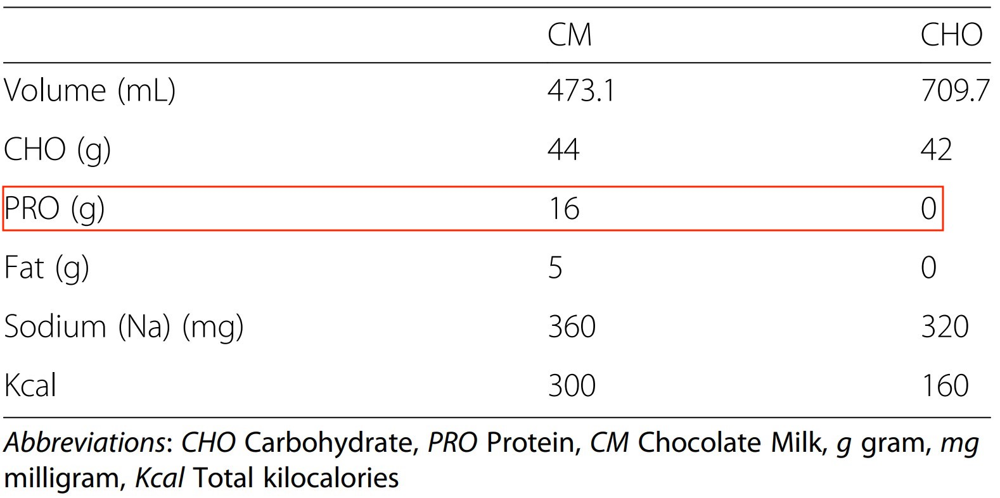
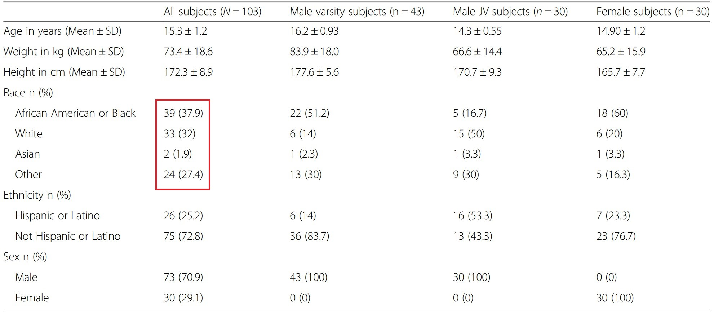
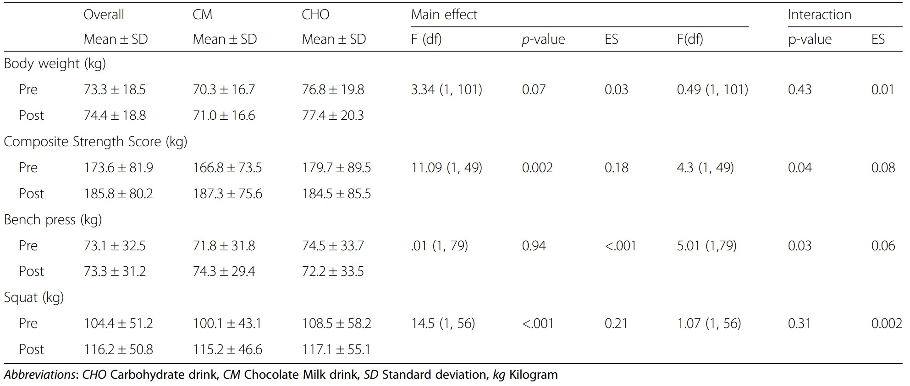

\captionsetup[figure]{name=Abbildung}
\captionsetup[table]{name=Tabelle}

```{r setup, include=FALSE}
knitr::opts_chunk$set(echo = TRUE)
knitr::opts_chunk$set(warning = F)
knitr::opts_chunk$set(message  = F)
knitr::opts_chunk$set(fig.align = "center")
```


# Zweck der Übung

Diese Aufgabe hat zum Zweck einen Artikel etwas genauer unter die Lupe zu nehmen und auf Stimmigkeit zu überprüfen. Dazu werden die im Artikel getroffenen Aussagen basierend auf der zugrundeliegenden Studie analysiert.

## Schokoladenmilch gegen normale Sportgetränke

Andy Chesire beschreibt in einem Artikel vom 22 August 2017 die Resultate einer Studie von der Universität Texas at Austin über den Unterschied von "post-training" verabreichten Schokoladenmilch (CM = Kohlenhydrate + Proteine) und normalen Sportgetränken (CHO = nur Kohlenhydrate).

Herr Chesire erklärt:

Die Athleten, die Schokoladenmilch tranken, drückten im Durchschnitt **3,5%** mehr als vorher auf der Hantelbank, während die Sportler, die das kommerzielle Sportgetränk tranken, ihre Kraft beim Bankdrücken um etwa **3,2%** verringerten. Das ist ein Nettounterschied von **6,7%** für diejenigen, die Schokoladenmilch im Vergleich zu einem kommerziellen Sportgetränk tranken.

Beide Gruppen zeigten eine Verbesserung bei Kniebeugen, aber die Schokomilch-Trinker zeigten mehr, sie hoben **15%** mehr Gewicht als vorher - während die kommerziellen Sportgetränketrinker nur **8%** mehr hoben. Das ist fast **doppelt** so viel Kraftzuwachs bei den Schokomilch-Trinkern.$\ _{1}$

Weiter beschreibt Herr Chesire dass der Unterschied von *normalen Sportgetränken* darin besteht, dass dem Sportgetränk das Protein fehle wobei Milch zwei Arten von hochwertigem Protein enthält Kasein und Molkeprotein. Weiter wird beschrieben, dass Milch pro Unze (28.35g) jeweils ein Gramm Protein enthält welches in Kombination mit den Kohlenhydraten aus der Schokomilch ein ideales Verhätnis zur Muskelerholung enthält.$\ _{2}$

Hinzufügend wird gesagt dass Schokomilch ein kostengünstiges Getränk ist zur Rehydration, Auffüllen der glykämischen Speicher und dem Muskelaufbau. Weitere Studien könnten herausfinden, wie andere Faktoren die UT-Ergebnisse beeinflusst haben - Dinge wie die Technik oder die Lebensmittel, die die Sportler zu Hause essen. Die Studie unterstützt jedoch Schokoladenmilch als Regenerationsergänzung für Jugendliche, die an intensivem Training teilnehmen.$\ _{2}$

Desweiteren ist die Studie verlinkt.


$\ _{1}$ *Original aus dem Englischen ins Deutsche übersetzt [@article]*
$\ _{2}$ *Sinngemäss aus dem Englischen ins Deutsche übersetzt [@article]*

\newpage


# Informationen zur Studie und dem Artikel

Die Studie [@study] wurde von der University of Texas at Austin USA durchgeführt und wurde finanziert von Dairy Max einem Verband von Milchprodukte Vertretern und erschien im Journal of the International Society of Sports Nutrition. Der Artikel [@article] ist auf der Website von Dairy Max erschienen und wurde von Andy Chesire welcher ebenfalls an der Studie beteiligt war, geschrieben.

## Beschreibung der Studie

Ziel der Studie war es den Effekt zu untersuchen, ob die Einnahme von Schokoladenmilch im Gegensatz zur Einnahme eines herkömmlichen Sportgetränkes, für die Erholungsphase von heranwachsenden Athleten einen Unterschied macht. 103 heranwachsenden Athleten (Frauen und Männer) wurden während eines 7 wöchigen Sommer Trainingprogrammes entweder CM (Schokoladenmilch) oder CHO (Kohlenhydrate) direkt nach dem Training verabreicht. In der ersten Woche sowie in der letzen Woche wurden Kraft und Ausdauertests durchgeführt. Wobei 5 Wochen lang 4 Tage die Woche trainiert wurde. Die Trainingseinheiten bestanden aus jeweils 1 Stunde Kraft und 1 Stunde Ausdauertraining pro Trainingstag, wobei direkt nach der letzten Trainingseinheit das Getränk verabreicht wurde.


```{r makro, out.width='100%', fig.cap="Makronährstoffe der verabreichten Getränke.", echo=FALSE,fig.align="center", out.width="60%"}

```

## Grundgesamtheit

Die Studie möchte einen Effekt der Einnahme von Schokoladenmilch als Erholungsgetränke nach einem Training untersuchen, da diese ohne weitere Verarbeitung einnehmbar ist, weit verbreitet und überall erhältlich ist. Die Studie referenziert auf andere Studien in welchen ein positiver Effekt von protein- und kohlenhydrathaltigen Nahrungsergänzungsmittel an Erwachsenen festgestellt worden konnte. Hier möchte man nun den Effekt an jugenlichen High School Sportler in den USA analysieren, da diese mit einer Anzahl von [@survey] 7'963'535 (Saison 2016-2017) eine grosse Zielgruppe repräsentieren und in bisherigen Studien ausser acht gelassen wurden.


## Auswahlrahmen

Der Auswahlrahmen soll die Grundgesamtheit möglichst gut repräsentieren. In dieser Studie wurden Teilnehmer eines Sommer-Traininglagers einer grossen westlichen High School ausgewählt. Es stellt sich die Frage ob rein nur die Testteilnehmer einer Schule repräsentativ für sämtliche High School Sportler der USA sein sollen und somit der Auswahlrahmen die Grundgesamtheit adäquat repräsentiert. Auf diese Frage werden in der Studie keine klaren Antworten geliefert.


In der Studie wird der Einsatz von Schokoladenmilch für die Erholungsphase getestet, ist nun der Anteil an Personen die eine Unverträglichkeit gegen Laktose haben sehr hoch, könnte es sein, dass man auf andere Lösungen kommen würde und man hier allenfalls ein verzerrtes Bild haben.


## Stichprobendesign

Es haben 131 Teilnehmer des Trainingslagers an der Studie teilgenommen, davon haben 103 die Studie beendet.
Die 28 fehlenden Werte (Nonresponses) werden nicht weiter diskutiert und es ist somit nicht klar warum diese aus der Studie herausfallen, oder wann und warum der Versuch abgebrochen wurde. 
Somit fehlen in der Studie 28 Werte die möglicherweise durch geschickte Imputationen einen Beitrag zur Auswertung der Resultate hätte bringen können.

Die Teilnehmer wurden bereits von den Trainern des Traningslagers in 3 Gruppen aufgeteilt. Die erste Gruppe enthält nur weibliche Teilnehemer im Alter zwischen 13-17 Jahren. Die zweite Gruppe enthält männliche Teilnehmer im Alter zwischen 13-15 Jahren und die dritte Gruppe enthält männliche Teilnehmer zwischen 15-17 Jahren.

In der Studie wird nicht erwähnt, ob die Stichprobe aus der gesamten Anzahl an Teilnehmenern gezogen wurde, oder ob auf eine bestimmte stratifizierte Art aus den von den Trainern vorselektierten Gruppen gezogen wurde (also ob beispielsweise gleichmässig gezogen wurde oder je nach relativen Häufigkeiten in den Gruppen).


Man weiss auch nicht, wieviele Nonresponses aus welcher Gruppe stammen.

### Designgewichte

Wenn man die Verteilung anschaut von gelisteten Schülern [@race] in den USA erkennt man eine Überrepräsentation von weissen Menschen gefolgt von Latinos, Schwarzen und Asiaten. Daraus lässt sich nicht unbedingt schliessen, dass dies auch auf die Verteilung der US-Highschoolsportler zutrifft, aber es lässt doch Zweifel offen ob die Stichprobe \ref{fig:subjects}, mit  40 % Schwarzen 33% Weissen bezüglich Ethnie oder mit 30% Frauenanteil repräsentativ ist.

Falls die Stichprobe die Grundgesamheit nicht repräsentiert, müssten die Designgewichte angepasst werden, jedoch wird in der Studie leider nichts darüber erwähnt. Deswegen gehen wir davon aus, dass alle in der Stichprobe vorhandenen Subjekte gleichgewichtet wurden was wiederum heisst das sie die Grundgesamheit repräsentieren soll.


## Stichprobe

Die Studie beschreibt, dass sie die Teilnehmenden zufällig in die 2 Kategorien CM und CHO eingeteilt wurden. Eine genaue Auflistung der gekreuzten Variablen (Gruppierungen) zu den beiden Testkategorien wird in der Studie nicht aufgezeigt, jedoch beschreiben die Herausgeber der Studie, dass keine statistische Unterschiede in den Gruppierungen festzustellen wären.

Zusätzlich mussten die Teilnehmer der Studie folgende Eigenschaften erfüllen:

* müssen Englisch sprechen
* sollen per Textnachricht erreichbar sein (Besitz eines Handys)
* keine Verletzungen aufweisen
* keine mentale oder physische Behinderungen
* keine Allergien (auf Stoffe welche die verabreichten Getränke beinhalten) oder laktoseintoleranz.

Gemäss [@lactose] sind ca 30% der erwachsenen Leute in den USA Laktose intolerant. Bei gewissen Bevölkerungsgruppen liegt die Laktoseintoleranz sogar weit höher zum Beispiel Personen mit asiatischen Wurzeln mit bis zu 90%. Diese Zahlen wurden zwar für erwachsene Menschen erhoben, jedoch schliessen sie eine nicht unerheblichen Teil aus der Grundgesamheit aus. Somit könnte das Ausschliessen von Menschen mit einer Laktose-Unverträglichkeit eine Verzerrung auf die Grundgesamtheit aufweisen.
Womöglich hätte die Einnahme von Schokoladenmilch bei einer laktoseintolarenten Person zu einem positiven Effekt auf das physische Training geführt und somit auch die Hypothese selber. Natürlich ist klar, dass eine laktoseintolerante Person nicht freiwillig Schokoladenmilch zu sich nehmen würde. Die Grundgesamtheit sollte somit sämtliche jugendliche High School Sportler enthalten die nicht laktointerlorant sind. Oder einfach ausgedrückt, die Grundgesamtheit beinhaltet nur jugendliche High School Sportler die die obigen Eigenschaften erfüllen.

\newpage


```{r subjects, out.width='100%', fig.cap="Auflistung der Studienteilnehmer.", echo=FALSE,fig.align="center"}


```

\newpage

## Versuchsaufbau


## Resultate

```{r results, out.width='100%', fig.cap="Resulte der Studie.", echo=FALSE,fig.align="center"}


```

-Unterschiede in den Stichproben selbst CHO - CM mehr als 10 kg unterschied vorher, trainings effekt nicht linear


Auf den ersten Blick erkennt man in den Resltaten für CHO und CM grosse Unterschiede.

Bei Squad unterscheidet sich der Mittelwert sogar um mehr als 10kg, wie in Abbildung \ref{fig:results} rot markiert zu sehen ist.
Um statistisch zu urteilen, wenden wir den z -test an und schauen ob die Unterschiede signifikant sind.

Da nicht angegeben ist wieviele Teilnehmer welches Getränk bekommen haben, (In der Studie wird beschrieben zufällige Zuteilung), nehmen wird die Zuteilung 51/52 an für die Hypothesentests.

$z=\frac{x1-x2}{    \frac{sd1^{2}}{n1} + \frac{sd2^{2}}{n2}    }$

mit:

$H_{0} : \mu_{1} = \mu_{2}$ und

$H_{1} : \mu_{1} \neq \mu_{2}$


\newpage
## Abkürzungen

- CHO = Kohlenhydrathaltiger Nahrungsergänzungsmittel
- CM  = Schokoladenmilch

## Referenzen

::: {#refs}
:::
